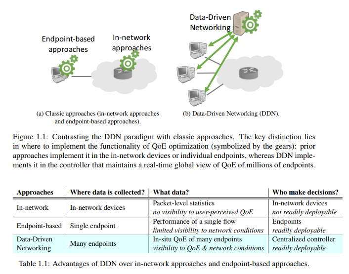

## Abstract

- Keywords: Internet applications, Quality of Experience, Data-Driven Networking, user-perceived
- The key contribution of this dissertation is to bridge the long-standing gap between the visibility to user-perceived QoE and the visibility to network conditions by a data-driven approach.
-  improve QoE by maintaining a global view of up-to-date network conditions based on the QoE information collected from many endpoints.
-  session-level
-  our solutions can yield substantial QoE improvement and consequently higher user engagement for video streaming and Internet telephony than existing solutions as well as many standard machine learning solutions.

## Introduction about DDN

- two broadly defined classes of prior approaches to optimize QoE
  - In-network approaches: better designs of in-network devices (e.g., routers, switches, and middleboxes) and routing schemes. lack of visibility to userperceived QoE
  - Endpoint approaches: using intelligent logic running at individual endpoints to react to changes in network conditions. limited by individual endpoints’ local visibility to network conditions
- DDN's features
  - Compared to in-network approaches, DDN can monitor client-side applications and thus can directly optimize user-perceived QoE, rather than indirect low-level metrics. Compared to endpoint-based approaches, DDN compensates the lack of visibility of network conditions at one endpoint by a real-time, **global view of QoE observed from many endpoints**, thus addressing the key limitation of the endpoint adaptation.
  - improve QoE by using **a logically centralized controller** (as illustrated in Figure 1.1) which maintains a global view of real-time network conditions by gathering QoE measured from many application sessions and uses this global view to make optimal decisions regarding the adaptation of individual sessions
  - 
  - use realworld deployment and large-scale emulation to demonstrate that our solutions can substantially improve the QoE of video streaming and Internet telephony.我觉得我们这里根本做不到
  - 几种方法： 
    - CFA: a video QoE prediction system that can accurately predict the quality of a video client if it uses certain CDN and bitrate
    - DDA：a throughput prediction system to accurately predict end-to-end throughput at the beginning of a video session to help determine the highestyet-sustainable initial bitrate
    - group-based exploration-exploitation：decomposes the global exploration-exploitation process of all sessions into subprocesses
    - guided exploration: instead of exploring the whole decision space of all possible relay choices, learns a small set of promising relays for each AS pair based on long-term (e.g., daily) historical data, and explores these promising relays using most calls in near real time.
  -  video QoE is measured by buffering time, start-up delay, and average bitrate, each of which has been shown to have strong correlation with user engagement in multiple studies.While subjective metrics can directly reflect user satisfaction, we chooseto use these objectively measurable metrics as a proxy for real user satisfaction for two reasons: (1) they can be passively collected en masse by instrumentation code running in client devices without any user input, and (2) they are less noisy than subjective metrics which can be affected by factors (e.g., content or personal preference) beyond the scope of this dissertation. QoE和选择objectively measurable metrics判定用户满意度的原因。

## QoE
- Video QoE metrics: buffering ratio; join time; average bitrate; join failures.
  - Dataset: based on client-side measurements of video quality from over 300 million sessions over a duration of two weeks. The unique feature of our dataset is that it is collected over 379 distinct content providers spanning diverse genres, both live and video-on-demand content, different content delivery platforms, different types of bitrate adaptation algorithms, and device/browser platforms.
- VoIP QoE metrics: poor call rate (PCR)
  - dataset: The dataset from Skype consists of a sampled set of 430 million audio calls drawn from a seven month period.
  - VoIP QoE distribution: The results show that a significant fraction of calls (over 15%) occur on paths with RTT over 320ms, or loss over 1.2%, or jitter more than 12ms, which we pick as our thresholds for poor performance.
  
## Internet Video
- 播放速率控制
  - Early Internet video technologies: Apple QuickTime, Adobe Flash RTMP (based on connection-oriented video transport protocols)
  - new generation of Internet video technologies: Microsoft Smooth Streaming, Apple's HLS, Adobe's HDS (全部都是HTTP-based adaptive streaming protocols)
- HTTP-based  adaptive streaming protocols' advantages: three points

## Internet Telephony
- managed overlay approach enjoys several practical benefits: three points

## Improve QoE
- Prior Work on Quality Optimization
- Taxonomy
  - Where in the network? endpoint-based solutions (clients, servers, caches)and in-network solutions (switches, routers).
  - Which level in the protocol stack? Lower levels and Application
- Design trade-offs
  - More visibility to user-perceived QoE
  - More visibility to network conditions
- In-Network Solutions
  - IP-layer support for QoS: novel QoS service architecture
  - Router-assist congestion control
  - SDN-based approach
- Endpoint Solutions
  - Overlay routing
  - Congestion control
  - Application-level adaptation
  - Network performance prediction:
    - to use packet-level probes to estimate end-to-end performance;
    - to build an “Internet performance map” based on active probes from a selective set of “vantage points”;
    - to leverage the history of the same client-server pair 

## evaluation of performance
- QoE metrics - we need to optimize user-perceived QoE
- Video measurements

## Prior Work on Data-Driven Optimization in Networking
- Better Settings of Parameters: While these efforts are in entirely different areas, they have largely exploited the same inefficacy in traditional control logic that the parameters are
statically configured based on assumptions that are ill-matched with the dynamic workload in
runtime.Such problem can be fixed by dynamically training these parameters with recent measurements or synthetically simulated data.
- Better Run-Time Decisions: 
  - In  other word, rather than inferring the underlying network states and finding best decisions analytically, it builds a model that directly associate quality feedback with decisions (configurations).  Research has shown that this more direct data-driven approach can improve the performance of  routing [181], TCP throughput [89], server selection in web performance [146], as well as bitrate  adaptation in video streaming [150]. (这不就机器学习吗)
  -  exploration-exploitation strategies (multi-armed techniques [215]), or Bayesian optimization

## Data-Driven Network
- Formalizing DDN
  - DDN is a new paradigm for designing the adaptation logic of end-to-end protocols (such as adaptive video streaming protocols)
  - DDN-based control loop is driven by real-time multi-session (not single-session) view of in-situ quality [100] measurement (not active measurements or indirect metrics), and automatically tuned actuation algorithms based on data-driven insights (with little to no manual tuning).
  - A DDN-enabled protocol has two additional components: (a) the client-side instrumentation code which runs inside client-side application to measure client-perceived quality of each session and applies decisions made by DDN; and (b) the DDN controller which runs two loosely coupled steps:(controller收集client的信息，controller做决定，client执行)
    - Aggregate quality measurement from client-side instrumentation into a global view of upto-date network conditions and some actionable insights.
    - Make control decisions based on the actionable insights, and send them to client-side instrumentation for execution.
  - Application Level, Session Level
  - Compared to prior work on data-driven optimization in networking
    -  (1) The input data of DDN is much larger both in scale and scope, allowing DDN to learn a more accurately model of the network conditions and make more informed decisions. (多个session)
    -  (2) The input data of DDN is collected from concurrent and history sessions that have different session-level features (client-side, network-level, and server-side), so the DDN decision logic must take into account the potentially complex relationship between these session-level features and QoE.
  - Several early applications of DDN from prior work
    - CDN/bitrate selection for video: a DDN controller that maps a video session to the CDN
and bitrate that has the best quality on similar sessions
    - Relay selection for Internet telephony: improvement on call quality by selecting optimal relay servers for each call
    - Online service cluster selection： By measuring end-to-end quality from clients and dynamically modeling the workload of network paths and servers, it can select proxies that reduce mean latency by 60% and carry 2× more traffic, compared with a baseline that finds proxies by Anycast.
    - File sharing: predict the throughput between a client and a server
  - Challenges for DDN
    - Need for Expressive Models
      - The algorithmic objective of DDN is to build a model that maps each session in the session-level feature space to the optimal decision in the decision space
      - High-dimensional relationship between session-level features and QoE: 
        -  we observe a combinational effect where video QoE is affect by a specific combination of feature values, but does not appear to be correlated with any individual feature
        - an accurate QoE prediction model must be expressive enough to capture all these spatial and temporal complexities.
      - Large decision spaces:  needs to find a good relay path for each VoIP call in a set of hundreds of relay points.
    - Need for Scalable Platforms
      - Global view vs. data freshness: 分布式的缺少global view，中心式的缺少对fresh data的考虑
      - Near real-time predictive analytics、
  - How Intuitively Persistent Critical Structures Address the Challenges?
    - Reducing session-level feature spaces: The advantage of persistentcritical structures is that each session’s QoE only depends on by a few critical features (rather than all features).(怎么确定critical features成了另外一个问题)
    - Reducing large decision spaces: reduce the decision set to a subset of most promising decisions which can be explore efficiently
    - Decomposing the decision-making process: To make decisions for the sessions in a group, we can use a logic that runs in the same frontend cluster where their fresh data is collected, and that uses only the information of these similar sessions to make decisions. (backend分组，每组的frontend make desicion)
    - Learning the persistent critical structures from data: 事实上是最难的
  - Making DDN Practical by Persistent Critical Structures (DDN一般的流程)
    -  Critical Features Analysis：each video session has a small set of critical features that ultimately determines its video quality, and these critical features change much more slowly than video quality
    -   Group-Based Control:the clients that exhibit similar QoE behavior will have similar network-level features (e.g., same IP prefix), and thus their fresh data will likely be collected by the same frontend cluster
    -   Guided Exploration: the stability of promising relay choices: for each pair of caller AS and callee AS, there is a small and stable subset of relays that almost always contains the best relay.

## Structural Analysis of QoE Problems
- In this chapter, we present empirical evidenceof these persistent critical structures by using a large-scale structural analysis on the video and VoIP QoE
- Internet Video
  - Methodology
    - Dataset: The dataset consists of client-side measurements of video quality from over 300 million sessions of 379 distinct content providers spanning diverse genres, both live and video-on-demand content, different content delivery platforms, different types of bitrate adaptation algorithms, and device/browser platforms
    - Session-level features: ASN、CDN、Content provider (Site)、VoD or Live、Player type、Browser、Connection type(mobile/fixed wireless, DSL, fiber-to-home)
    - Identifying problem sessions:join failures, buffering ratio, bitrate,  join time
    - Identifying problem clusters
    - Identifying critical clusters:
  - Temporal Patterns
  -  Spatial Patterns

## Predictive QoE Optimization By Critical Feature Analysis
- improves video QoE by formulating DDN as a prediction problem
- video quality can be substantially improved by optimally selecting the best CDN and bitrate for each video session
- Critical Feature Analytics
- Challenge
  -  Challenge 1: Complex QoE-Determining Factors
     -  High-dimensional relationship between video quality and session features
     -  Limitation of existing solutions
     -  Highly diverse structures of factors: The factors that affect video quality vary across different sessions. This means the prediction algorithm should be expressive enough to predict quality for different sessions using different prediction models.
  - Challenge 2: Fresh Updates
    - prediction error increases dramatically if the staleness exceeds 10 minutes
    - The requirement to use the most recent measurements makes it infeasible to use computationally expensive models.
  -  Overview of CFA Ideas
     -  Baseline Prediction Algorithm
        - At a given time, video sessions having same value on every feature have similar video quality.
        - In our dataset, more than 78% of sessions have no identical session (i.e.,matching on all features) within the last 5 minutes.
      - Critical Features
        - Each video session has a subset of critical features that ultimately determines its video quality.
        - First, find the critical features of each session s, denoted as CriticalFeatures(s).
        - Then, find similar sessions that match values with s on critical features CriticalFeatures(s) within a recent history of length ∆ (by default, 5 minutes).
        - Finally, return some suitable estimate of the quality of these similar sessions
  - Design of CFA
    - Critical features tend to persist on long timescales of tens of minutes.
    - Learning Critical Features
      - Persistence implies that critical features of a session are learnable from history
    - Using Fresh Updates
      - Persistence implies that critical features can be cached and reused over tens of  minutes.
      -  On the timescale of tens of minutes, we update the results of critical feature learning. Then, on a faster timescale of tens of seconds, we update quality estimation using fresh data and the most recently learned critical features.
      -  This decoupling minimizes the impact of staleness on prediction accuracy.
  - Implementation and Deployment
    - Centralized backend:
      - By default, critical feature learning runs every 30 minutes, and quality estimation runs every minute.
    - Distributed frontend
      - Real-time query/response and decision makers of CDN/bitrate are colocated in distributed frontend clusters that are closer to clients than the backend
      - Each frontend cluster receives the quality function from the backend and caches it locally for fast prediction.
  - Relationship to existing ML techniques
    - Multi-armed bandit algorithms [215] find the decision with the highest reward (i.e., best CDN and bitrate) from multiple choices. 
    - The feature selection problem [106] seems similar to critical feature learning, but with a key difference: critical features vary across video sessions

## Cross-Session Throughput Prediction for Initial Video Bitrate Selection 初始视频码率的选择
- Backgroud
  - Existing approaches to initial bitrate selection, however, are inefficient
  - A video player should ideally pick the highest initial bitrate that is sustainable
  - Dataset
    - FCC dataset: This dataset consists of 9.9 million sessions and is collected from 6204 clients in US spanning 17 ISPs. 
    - Supplementary VoD dataset: 0.8 millions VoD sessions, collected by a major video content provider in China. 中国哪家的啊。。。都没看到怎么获取
- Design of DDA
  - Insight of DDA
    - DDA finds for a given session a prediction model between the Nearest Neighbor and Global prediction models, so that it strikes a balance between being closer to Nearest Neighbor for accuracy and being closer to Global for reliability
    - Second, instead of mapping all sessions to the same prediction model, DDA maps different sessions to different prediction models.（“Nearest Neighbor” prediction model、“Global” prediction model、...）
  - Algorithm
    - Overall workflow
      - First, DDA learns a prediction model $M_s^*$ based on history data.
      - Second, DDA estimates s’s throughput by the median throughput of sessions
    - Learning of prediction model
      - First, DDA learns a prediction model $M_s^*$ based on history data from a pool of all possible prediction models(这很大程度取决于你的model pool的选择)
      -  DDA takes a data-driven approach and finds the best prediction model over a set of history sessions Est(s) 
  -  Improvement of Bitrate Selection
  
## Improving QoE via Exploration and Exploitation at Scale
-  data-driven QoE optimization should instead be cast as a real-time exploration and exploitation (E2) process rather than as a prediction problem. 
-  Pytheas
-  Using an end-to-end implementation and a proof-of-concept deployment in CloudLab
-  Limitations of Predictive Approaches
   -  Limitation 1: Prediction Bias
   -   Limitation 2: Slow Reaction
- Casting QoE Optimization as a Exploration-Exploitation Process
  - Note that the reward functions could change over time, and thus this is a continuous process rather than a one-time shot.
  - Challenges of E2 in the Networking Context
    - need fresh measurements of all sessions, but getting such a fresh and global view is challenging
    - Traditional E2 techniques also make strong assumptions about the context that affects the reward of a decisions, but they may not hold in network settings.
  - Overview of Pytheas 
    - if two sessions share the context that determines their E2 decisions, they will be likely to match on some network-specific features.
    - we group together sessions with similar context by network locality and other key features (such as device and location), and use one E2 process for each group.
    - System overview
      - Each session group is managed by one per-group E2 process run by one frontend cluster
      - When a session comes in, it sends a request for its control decisions, which includes its features, to the Pytheas system
      - The request will be received by a frontend cluster, which maps the session to a group based on its features, then gets the most up-to-date decision from the local per-group E2 process, and returns the decision to the session
      - Each session measures its QoE and reports it to the same frontend cluster. When this frontend receives the QoE measurement, it again maps the session to a group, and updates the E2 logic of the group with the new measurement.
    - Pytheas Algorithms
      - Session-Grouping Logic
        - sessions in the same group share not only the best decision, but also the factors that determine the best decisions.
        -  Given a session set, the session-grouping logic should output any non-overlapping partition of sessions
      -  Per-Group E2 Logic
         -  UCB (Upper Confidence Bound) algorithms [48] are a family of algorithms to solve the multi-armed bandits problem
      - First, each frontend cluster runs an active E2 algorithm rather than merely executing the (stale) prediction decisions as in prior work. 
      - Second, the frontend clusters now run per-group logic, not per-session logic.
      - Frontends and Backends
        - Frontends: Pick one cluster as the leader cluster of this group and let it run the E2 logic of the group based on the measurements. Oher clusters, called proxy clusters of the group, receive decisions from the leader cluster. Proxy clustersforward QoE measurements to the leader cluster
        - Backends: Updating Session Groups
          - the backend runs the session-grouping logic to decide which group each session belongs to, and outputs a session-to-group table
          - we select the frontend cluster that receives most sessions in the group as the leader
## Expressions
- Expressions
  -  it has become of paramount importance that ...
  -  Despite the intense research towards better Internet QoE ...
  -  We elaborate on these quality problems in Chapter 2.
  -  other details are omitted for clarity.
  -  leverage 利用
  -  well-provisioned  精心调配的
  -  our ultimate objective is to improve
  -  As we will see, our solution strikes a better balance between the visibility to user-perceived QoE and the visibility to network conditions through taking a more data-driven approach to endpoint solutions
  -  dissertation 专题 The main contribution of this dissertation is ...
  -  n essence, ... 本质上
  - a key domain-specific insight  that enables us to address both challenges in practice\
  - As a concrete example, let us consider 