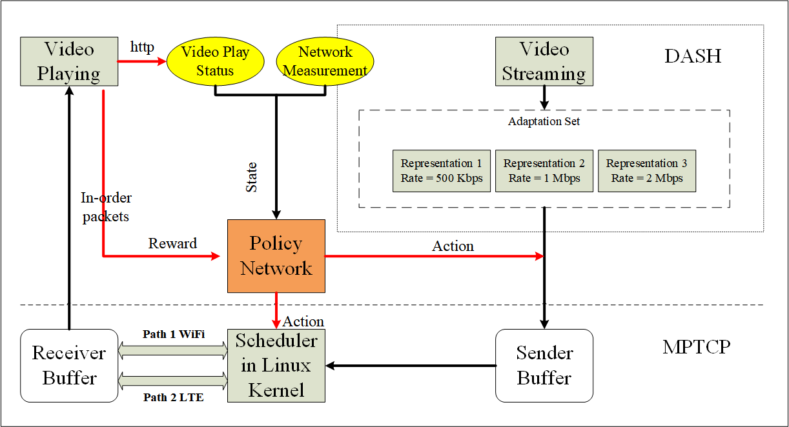

# 多路径传输中是视频传输和强化学习算法调研 + Research Proposal

## Video Streaming and Multipath

### Cross-Layer Scheduler for Video Streaming
- Our objective is to increase the quality of experience (QoE) of the viewers by maximizing the reception of decodable video data in difficult conditions (video bit-rate close to the available bandwidth and small application buffer).
- Problem Description
  - most transport protocols, including TCP, MPTCP and UDP, work at the bit-stream level and are not aware of the structure of the transported data
  - Particularly, data are transmitted from the  MPTCP Sending Buffer in the same order as they arrived  to this buffer, even if some data should no longer be sent,  for example an obsolete video unit whose playback deadline  has already expired. Such an event is likely to occur in  transport protocols that guarantee in-order delivery, such  as TCP and MPTCP because the loss of one data packet  can delay the delivery of multiple following packets.
  - 普通的视频传输只会用ACK确认是否有到达，而不会标记和回传packet到达时间。回传到达时间可以让server在用户playback时估计用户可以在缓存中读取数据还是需要重新传输数据。
- Passing Information between the Different Layers
  - Video content awareness
    - The cross-layer layer knows all those  dependencies and so is able to infer whether the client can  decode a video unit at a specific time or not. Each video  unit is associated with a specific video frame (even for  tiles)
  - Network awareness
    - The cross-layer scheduler knows the  status of the network, including the smoothed Round-Trip  Time (sRTT), the global moving average bandwidth and  the loss probability of each path
    - With the sRTT, the  cross-layer scheduler can estimate the arrival time of each  packets, and choose to send a video unit close to its  deadline on the path with the shortest sRTT.
    - From the  moving average bandwidth, the scheduler can choose to  drop some less important video units to favor others. 
    - From  the loss probability, it can choose to send highly important  video units on the path with the smallest loss probability
    - the cross-layer scheduler needs to  implement a feedback loop from the MPTCP socket.  Although such feedback does not exist in open-source  implementations yet, the development is not challenging  since the server hosts both the MPTCP implementation  and the application.
  - Application awareness
    - The cross-layer scheduler knows the  status of the video player on the client. It can estimate the  lag at the client side. 
    - From the lag, the start  timestamp and the POC, the cross-layer scheduler can  estimate the deadline of each video unit.
    - The client can add extra information in its HTTP requests or use Real-Time  Transport Control Protocol (RTCP) to implement this  feedback in practice. The lag is a fixed value, which can be  communicated to the server. The hardest thing is to  estimate the timestamp when the client starts playing the  decoded video.
- Algorithm
  - The goal of our algorithm is to prioritize the video units that are the most likely to be received in time
  - The crosslayer scheduler is content-aware (it knows how to extract  video units) and application-aware (it is able to estimate  their playback deadline from an applicative feedback loop).  It is also network-aware (it knows which path the MPTCP  stack selects to send the next packet as well as the sRTT of  this path)

## Multipath and DRL (INFOCOM 2019, Nanjing University)

### Path select
- The reinforcement learning algorithm gets the information of every path and adaptively choose the most suitable path by the artificial intelligence.
  - introduce DQN framework to enhance the MPTCP data scheduling performance in the asymmetric path
  - assume the data scheduling problem and the path selection problem can be formulated as a MDP problem which can be calculated as the reinforcement learning problem.
- RL Model
  - we use the sending window as the state of agent and the path as the action, so the value function is based on the sending window, the reward and the action.
  - The aim is to optimize path selection to improve the transmission efficiency, and the model needs the information of state, action, and reward to make the decision
  - We define the reward and punishment to  impact to path selection. 
    - First, if we receive the acknowledgement of successful transmission from the chosen path, there  will be a positive 1 reward for this path, but if we can not  receive the acknowledgement, no matter the acknowledgement  is lost or the data transmission is not finished in deadline, we  will punish this path by getting the reward as -1. 
    - what is more, if the path is not available now, it will also get the punishment
- Evaluation
  - The simulation is build on the famous Network Simulator version 3(NS3) with the newly added MPTCP module [13]
  - the simulation is established under the heterogeneous condition to simulate asymmetrical networks. 

### Multipath Data Scheduler 
- A scheduler is responsible for determining the amount of data packets to be distributed onto the subflows, which has a significant impact on the performance of MPTCP
- Problem Description 
  - A typical value of SI (scheduling intervals) is 200ms, which is about 3∼4 RTTs
  - The scheduler’s goal is to find the best set of split ratios (p1, p2, ··· , pn) for the subflows that lead to the optimal performance
- Solution Framework
  - Online scheduling
  - Offline training
  - The online scheduling and offline training process run asynchronously and iteratively. After each episode the trainer synchronizes the scheduler with the trained neural network in adaption to the environment changes, driving the scheduling policy towards the optimum
  - Reward Function :$R\left(s_{t}, a_{t}\right)=V_{t}^{\text { throughput }}-\alpha V_{t}^{\mathrm{RTT}}-\beta V_{t}^{\text { lost }}$

- System Design
  - At the sender, the chunk data coming from the application (APP) is stored in the meta buffer, and is then fetched, split, scheduled, and transmitted by the MPTCP scheduler.
  - The policy network generates actions that determine the split ratio of each subflow for packet scheduling.
  - The network states, actions, and rewards in each SI are passed to the collector and stored in a replay buffer, which will be used by the trainer to train the reinforcement learning model and update the policy network
  - Receiver passively receives or acknowledges the data, reassembles it in the receiver-side meta buffer, and delivers the in-order data to the APP.
  - In the implementation of the system, it requires interaction between the kernel and userspace
- Evaluation
  - We implement ReLeS in the Linux kernel base on MPTCP v0.92 and evaluate it over both emulated and real network conditions.
  - For emulation, we use Linux tc to throttle the bandwidth and to add extra delay on the sender.
  - We consider different downloading files sizes varying from 64KB to 256MB to test the performance of the schedulers under different traffic classes.
  - Tests under real-world settings (five locations)
    - office, library, supermarket, dormitory and canteen
    - Google Nexus 5 smartphone - Android 4.4, based on MPTCP v0.86.x

## My Research Proposal

### Backgroud
- Video streaming is the major source of traffic in mobile network.Currently, video content accounts for 50% of the cellular traffic and it is expected to account for around 75% of the mobile data traffic by the year of 2023 [1]
- It is common that today’s client hosts are equipped with multiple network interfaces. For example, mobile devices  inherently support WiFi and cellular networks at the same time.
- In particular, HTTP-based ABR protocols dominate today’s landscape of video streaming over the Internet, and operate using multiple quality levels that are requested by video players one  segment at a time. Most video websites adopt DASH, like YouTube, Netflix and bilibili.
- In wireless networks, it is well-known that variability in network bandwidth affects video streaming.
- 移动终端视频流量日益显著增加+移动终端均双网卡+现有的主流视频网站采用DASH
- try to improve mobile users' QoE for DASH video streaming by multipath TCP
- 
### Problem Description
- DASH needs to select one out of the L versions based on its estimation of the network condition and the buffer capacity. (YouTube: 144p, 240p, 360p, 480p,720p, 1080p, 3GPP Relaese 10已经将DASH纳入其中)

#### DASH 
[//]: # (DASH之前我们组没有关注到的地方是不同Segment的内容)
- - 
- To play the content, the DASH client first obtains the MPD. The MPD can be delivered using HTTP
- MPD ：媒体文件的描述文件
- 客户端首先请求视频的MPD文件后解析获得视频包含的版本信息，客户端根据测试的带宽信息决定请求不同码率的视频。即不同的Representation，之后序列传输该视频码率(Representataion)下的媒体文件(Segment)。
  - 初始的mp4文件，相当于视频头，在这个头文件中包含了完整的视频元信息(moov)。很小的一个文件，基本在1KB左右
  - 上面提到的Segments文件，每个m4s仅包含媒体信息 (moof + mdat)，而播放器是不能直接播放这个文件的，需要用支持DASH的播放器从init文件开始播放。
- 最初想根据Initialization Segment与其他媒体Segment重要性不同区别对待，但当抓包后发现Initialization Segment只有1KB后这个想法就被抛弃了。

#### Problem
- 主流的视频网站都采用DASH作为视频流的播放解决方案，作为我们的视频端到端传输背景
- 现有的多路径数据调度算法
  - MinRTT, the default scheduler of MPTCP, attempts to fill the congestion window of the subflow with the lowest RTT before advancing to other subflows。总是优先利用带宽高的
  - The ReMP scheduler duplicates packets over all subflows in exchange for reliability。冗余传输提高可靠性
  - BLEST [13], a blocking estimation based scheduler, which takes a proactive stand towards minimising HoL-blocking
  - The DEMS scheduler [14] aims at reducing the data chunk download time over multiple paths, whose benefits are maximized when the file size is small or medium
  
[//]: # (现有的Segment大小是固定，在multipath环境传输时，当两条路径都比较差时对QoE提升是没有用的。原因Segment最小150KB,最大2MB。)

[//]: # (但考虑到packet MTU,不可能每个packet都schedule/在LTE和WiFi差别大时，MPTCP会倾向于带宽更好的那条路径传输？这个好像看packet schedulering算法)

- 现有的Multipath packet调度算法在视频应用中没有考虑视频的特性，对于视频的端到端传输需要改进
  - 视频包有前后的时间顺序，且后边依赖前边
  - 视频包的重要性与play deadline 有关，距离播放时间越接近该包传输越急迫
    - 当有包传输失败，重传该包时该包较正常传输包更重要
  - 视频的流量很大，移动终端用户会考虑资费的问题从而对WiFi传输链路更加偏好
故需要针对Video Streaming设计packet 调度算法
-  reward中考虑了用户观看视频QoE和WiFi的偏好
- 考虑cross-layer的调度，包括application layer码率的选择和transport layer包的调度。
  - 这两个调度并非独立，码率的选择不当会使传输层丢包数增加，重传增加进一步增加网络开销，降低带宽；
  - 包调度的不当会使得应用错误估计网络状况而选择传输低码率的视频，降低user-perceived QoE
  - 合适的决策(码率选择+包调度)能有效地利用多路传输的优势提升视频质量到以前单路径传输所达不到的水平
- 为什么使用学习？
  - 网络的异构性，非对称网络，差别较大
  - WiFi和LTE网络均是Wireless Network，网络波动较大
  - 参数较多，且优化目标考虑综合指标(comprehensive goals)

[//]: # (双链路的总带宽并非1+1=2)
[//]: # (iperf测试链路带宽)
[//]: # (linux tc控制模拟链路 或者Dummynet)
### Framework
- State
  - cnwd of each path
  - bandwidth measurement of each path
  - mean RTT of each path
  - sender buffer level
  - player buffer level
  - 当前待传输包与player当前播放内容时间的距离 

[//]: #  (用户可能会快进，与player buffer level不冲突，考虑丢包率会引起HoL问题，有些包的优先度不同)
- Action
  - 分辨率(Representation)选择(3~6个选择)
  - packet 选择路径传输(两个选择)
 
[//]: # (考虑到每个包都这样调度可能不太合理，可以以segment传输为单位，输出该segment在各路径上传输的比例 这个还没想好)
- Reward
  - $\alpha f_1(视频码率)+\beta f_2(码率切换次数)+ \gamma f_3(播放失败次数)+ \delta f_4\left(\frac{WiFi传输数据量}{LTE传输数据量} \quad \right) $

- 
Policy Network 在服务器端运行
- 这个框架与现有的DASH有一个很大的不同是:现在通用的DASH是客户端而非服务器端来根据网络状况请求不同码率的视频，而该框架下DASH是服务器端根据收集的状态信息决策传输哪个码率的视频。

### Expected Outcomes
- 前期
  - 两路网络数据集: WiFi+LTE
  - 计算的方式在两条链路上传输视频，每隔固定时间决定是否传输下一个video segment
    - 根据当前播放内容时间标签与已有效缓存内容时间标签距离决定
  - 若传输则利用DRL决策分辨率和包的传输路径，否则等待下一个时隙决定。一般一个周期设为2~4s。
- 学习训练的环境应利用商业网络trace得到的数据，将来在实际网络环境验证时实际环境与训练环境的网络状态相似的话效果预期应该会比较好。
  - 相似应该主要是带宽，固定测试场所和时间比较容易达到目的。一般环境下带宽越高网络环境越好
  - 希望的训练和测试环境均是单路带宽小于最高分辨率的带宽要求，双路可以弥补单路的不足，提升画质
- DASH over Linux kernerl based MPTCP
  - 实现的难关主要在于修改MPTCP scheduler需要改完源码再编译进linux内核测试是否有效，debug会很费精力
  - 硬件要求
    - 一台电脑做服务器(不要求双网卡)
    - 一台电脑配置双网卡，模拟client请求视频。前期可用以太网+无线网卡，后期实际环境可用4G上网卡。
    - 一个路由器，用于两条电脑间组网(理想环境)。利用Linux tc控制带宽，延迟和抖动等服务器端数据。
    - 后期可将服务端部署到云服务器，在商业网络下用无线网卡+4G网卡测试实际环境。